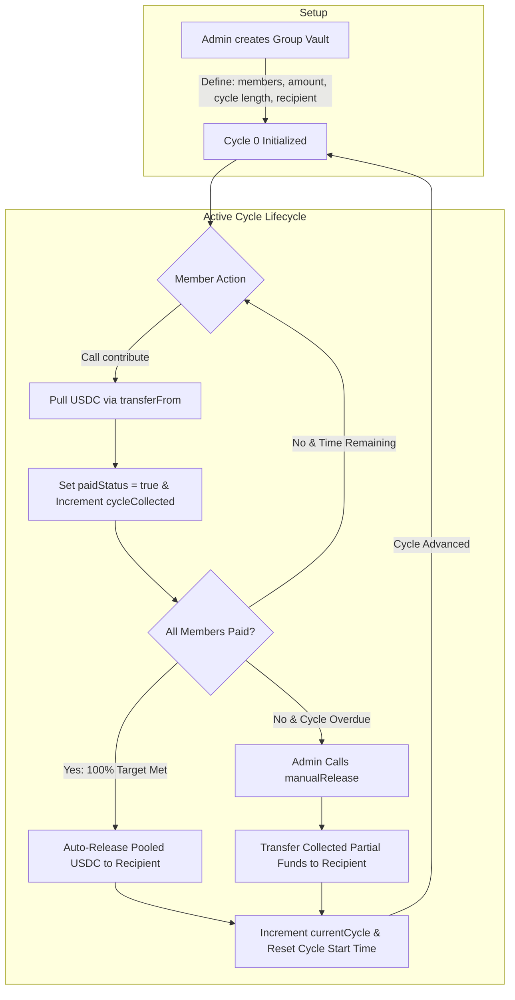

# Oream 🪐
### *Automated Recurring Shared-Expense Vaults on Arc Layer-1*

[](https://docs.arc.io)
[](https://circle.com)
[](https://soliditylang.org)
[](https://vitejs.dev)
[](https://tailwindcss.com)
[](LICENSE)

---

## 📑 Table of Contents
1. [Executive Summary & Problem Statement](#-executive-summary--problem-statement)
2. [Why Arc Layer-1 & Circle Ecosystem?](#-why-arc-layer-1--circle-ecosystem)
3. [Key Innovation & Core Features](#-key-innovation--core-features)
4. [System Architecture & State Machine](#-system-architecture--state-machine)
5. [Smart Contract Specification (`Oream.sol`)](#-smart-contract-specification-oreamsol)
6. [Market Opportunity & Business Model](#-market-opportunity--business-model)
7. [Quickstart & Judge Verification Guide](#-quickstart--judge-verification-guide)
8. [Tech Stack](#-tech-stack)
9. [Future Product Roadmap](#-future-product-roadmap)

---

## 💡 Executive Summary & Problem Statement

### The Problem: The $100B+ Group Expense Nightmare
Across co-living roommates, DAO operations, SaaS subscription shares, and creator collectives, **managing recurring shared expenses is broken**:
- **Manual Chasing**: Group admins constantly track down late payers across Venmo, Zelle, or WhatsApp.
- **Gas Friction**: Web3 solutions historically force non-crypto users to buy native ETH/MATIC just to pay a $25 utility share.
- **Opaque Vault Accounting**: Off-chain spreadsheets lack real-time auditability, resulting in disputes and missed deadlines.

### The Solution: **Oream**
**Oream** is a decentralized protocol built on **Arc Layer-1** that formalizes and automates recurring group expense collection. Group admins define contribution parameters (amount, cycle frequency, and beneficiary address). Members contribute **USDC** directly into cycle vaults. 

Once 100% of cycle funds are deposited, **Oream smart contracts automatically release the pooled USDC** to the intended recipient (e.g. landlord, subscription provider) and advance the vault into the next billing cycle—all with **zero manual intervention**.

---

## ⚡ Why Arc Layer-1 & Circle Ecosystem?

Oream leverages **Arc**, an EVM-compatible Layer-1 purpose-built for programmable money, offering unique structural advantages:

- **Native USDC Gas Economy**: Users pay transaction fees directly in USDC. Roommates never need to buy ETH or native gas tokens to pay rent.
- **Sub-Second Deterministic Finality**: Immediate confirmation of member payments without cycle delay.
- **Circle Platform Synergy**: Fully compatible with Circle's **CCTP (Cross-Chain Transfer Protocol)** and **Programmable Wallets** for seamless fiat onboarding and cross-chain contribution flows.

---

## 🌟 Key Innovation & Core Features

### 🔄 1. Self-Executing Cycle Vaults
Define terms once (`amountPerMember`, `cycleLength`, `recipient`). The contract autonomously tracks payments per cycle, triggers instant payouts upon full funding, and resets member status for the next cycle.

### 🛡️ 2. Dual Payout Mechanism (Auto & Overdue Override)
- **Automated Instant Release**: The second the final member pays, funds are pushed to the recipient.
- **Admin Emergency Release**: If a deadline passes before 100% completion, the admin can manually trigger a partial payout to ensure landlords or service providers receive collected funds on time.

### 📊 3. Real-Time Transparent Dashboard
- **Interactive Progress Trackers**: Live percentage completion bars, countdown timers, and active member status badges (`Paid` vs `Unpaid`).
- **On-Chain Audit Log**: Complete historical record of every completed cycle, timestamps, and payment proofs.

### 👛 4. Integrated Role Simulation Engine
For friction-free testing, the frontend includes a **Role Switcher toolbar**. Hackathon judges and investors can instantly toggle between **Admin**, **Member 1**, **Member 2**, and **Recipient** personas to experience real-time contract state transitions in seconds.

---

## 🏗️ System Architecture & State Machine



---

## 📜 Smart Contract Specification (`Oream.sol`)

The `Oream.sol` contract serves as the trustless vault manager for all group expense pools.

### Core Data Structure
```solidity
struct Group {
    address admin;            // Vault creator / administrator
    address recipient;        // Wallet receiving cycle funds (e.g. Landlord)
    address[] members;        // Participating member addresses
    uint256 amountPerMember;  // Contribution per member (USDC 6 decimals)
    uint256 cycleLength;      // Cycle duration in seconds (e.g., 30 days = 2,592,000)
    uint256 currentCycle;     // Active cycle index
    uint256 cycleStartTime;   // Start timestamp of active cycle
}
```

### Key API Interface

| Function | Access | Description |
| :--- | :--- | :--- |
| `createGroup(address[] _members, uint256 _amount, uint256 _cycleLength, address _recipient)` | `external` | Initializes a new recurring vault and emits `GroupCreated`. |
| `contribute(uint256 groupId)` | `external` | Pulls `amountPerMember` USDC, updates payment state, and triggers auto-release if target reached. |
| `manualRelease(uint256 groupId)` | `external` | Admin-only function to payout collected funds post-deadline when members default. |
| `getCycleStatus(uint256 groupId, uint256 cycle)` | `external view` | Returns member array, payment boolean statuses, total collected, and target total. |
| `getGroup(uint256 groupId)` | `external view` | Returns complete `Group` metadata struct. |

---

## 📈 Market Opportunity & Business Model

### Total Addressable Market (TAM)
- **Co-Living & Roommates**: $120B+ annual rental market across urban young professionals & students.
- **Shared SaaS & Digital Subscriptions**: $2.4B market for shared Netflix, Spotify, AWS, and OpenAI team accounts.
- **DAO & Web3 Collectives**: Thousands of decentralized squads requiring recurring operational pool collections.

### Protocol Monetization Strategy
1. **Protocol Vault Fee**: A nominal 0.25% fee deducted upon cycle release.
2. **DeFi Yield Farming**: Vault deposits placed into low-risk Aave/Circle Yield protocols during active cycles, generating interest prior to payout.
3. **B2B Property Management SaaS**: API licensing for property managers to automate rent collection across multi-tenant buildings.

---

## 🚀 Quickstart & Judge Verification Guide

Experience Oream locally in under **60 seconds**:

### Prerequisites
- **Node.js**: v18.0.0 or higher
- **npm**: v9.0.0 or higher

### Installation & Setup

1. **Clone the Repository**:
   ```bash
   git clone https://github.com/yoqnilen/oream.git
   cd oream
   ```

2. **Install Dependencies**:
   ```bash
   npm install
   ```

3. **Launch Development Server**:
   ```bash
   npm run dev
   ```

4. **Explore the Application**:
   - Open `http://localhost:5173` in your browser.
   - Use the **Role Switcher** at the top right to simulate different wallet accounts (`Admin`, `Roommate 1`, `Roommate 2`).
   - Create a group, simulate member contributions, and watch the contract auto-release funds to the recipient in real-time!

---

## 🛠️ Tech Stack

- **Smart Contracts**: Solidity v0.8.20 (EVM Compatible)
- **Blockchain**: Arc Testnet (Native USDC Gas Token)
- **Frontend Framework**: React 18, Vite
- **State & Web3**: React Context API, Viem, Circle App Kit / Skills support
- **Styling**: Tailwind CSS, Glassmorphic UI design system, Lucide Icons

---

## 🗺️ Future Product Roadmap

- [ ] **Phase 1 (Q4 2026)**: Circle CCTP integration to allow members to pay from any EVM chain (Arbitrum, Optimism, Base).
- [ ] **Phase 2 (Q1 2027)**: AI Keeper Bot integration to automatically pull USDC allowances without manual button clicks.
- [ ] **Phase 3 (Q2 2027)**: On-Chain Roommate Credit & Reliability Score based on historical cycle performance.
- [ ] **Phase 4 (Q3 2027)**: Unequal share allocation (e.g. Master Bedroom 40%, Room B 30%, Room C 30%).

---

<p align="center">
  <b>Oream Protocol</b> • Built for Hackathons & Future Web3 Payments on <b>Arc Blockchain</b>
</p>
